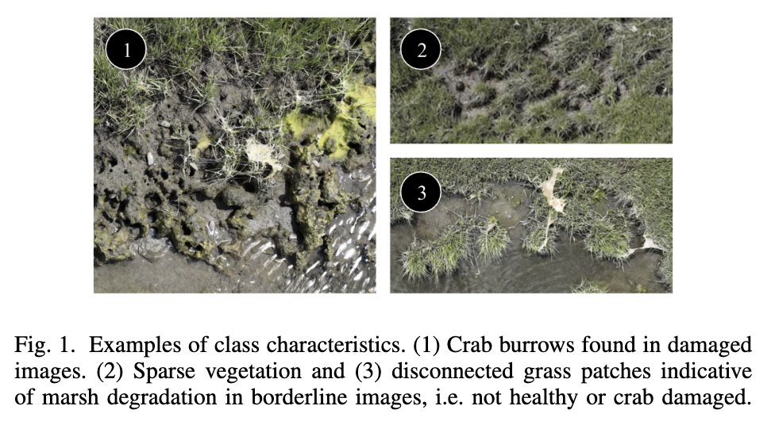

# Crab Damage Detection for Marsh Conservation

This repo contains a machine learning pipeline for detecting crab damage in drone imagery of marshes to aid with conservation efforts, designed for field deployment on Unmanned Aerial Vehicles (UAVs).

---

## Overview of project
This project automates the detection and classification of marsh damage caused by crabs using aerial drone imagery. By leveraging computer vision, it aims to reduce manual surveying time and help conservationists monitor wetland health more effectively. We present a modular, easily adaptable pipeline built on Ultralytics YOLO and optimized for edge deployment on UAVs, allowing for real-time identification of damaged areas in the field.

## Dataset and image classes
This pipeline supports binary classification of images into undamaged and damaged classes, as well as multiclass classification into healthy, borderline, and damaged classes. Our model is primarily designed for the classification of nadir drone imagery. Our dataset consisted of nadir images shot at 15 meters.

We classified the nadir images into three classes: healthy, borderline, and damaged. We defined the damaged class as images that contained any crab burrows; the borderline class as images that contained visible signs of marsh degradation but not crab burrows, such as sparse vegetation and regions of disconnected grass patches at the land-water interface, indicating either ongoing crab infestation or high risk of infestation; and the healthy class as images with no signs of crab damage or other degradation. See Fig. 1 for examples.



## Instructions for use

#### Hardware requirements

#### Software requirements
See `requirements.txt` for required packages.

### Step 1: Install required packages

Create a virtual environment and run

```bash
pip install -r requirements.txt
```
to install the necessary packages.

### Step 2: Dataset structure

Organize your image dataset into the appropriate directory structure based on  classification task:

* **Binary classification:**

```text
dataset/
├── damaged/
└── undamaged/
```

* **Multiclass classification:**

```text
dataset/
├── borderline/
├── healthy/
└── damaged/
```

### Step 3: Run classification pipeline

Run `binary.py` for binary classification and `multiclass.py` for multiclass classification. Before running, set the `DATASET_PATH` variable in the file to the base path to your dataset. Additionally, modify the `ROWS` and `COLS` variables if needed.

## Acknowledgements
